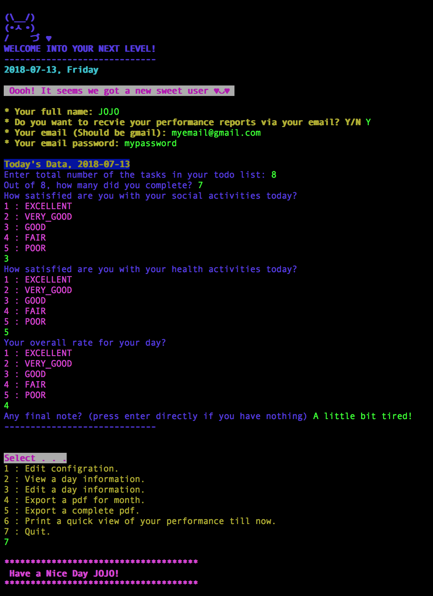
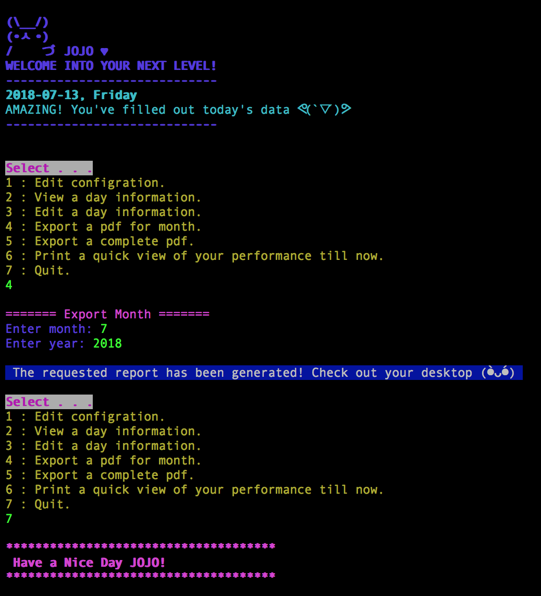

## Move Your Time Managment Skill to the Next Level and Achive your goals.
Python script helps you having a good time management skill by evaluating your daily perfomance .

### The Script Idea
You daily run the script and enter your numbers for the day:
1. Total number of tasks in your todo list.
2. Completed tasks.
3. Rate your social activity.
4. Rate your health activity.
5. Rate your overall performance in this day.
6. Write some notes.

Then, the script will generate a monthly report for your performance at the end of each month in a folder named "next_level_reports" in your desktop. Also, it will send it to your email if you choose this option.

### How to Use It?
1. Clon the repo.
2. Install requirements.txt.
> $ pip install -r requirements.txt
3. Run the app.py
> $ Python app.py
4. Fill the information.

So, at the end of each day you should run the app.py script and enter your numbers.

### Terminal Screenshot for the 1st run

### Terminal Screenshot for the further run

### Sample of monthly report
[sample report](2018-07.pdf)

### Important Notes
- Your email address should be **gmail**.
- You should allow  [“less secure apps”](https://www.google.com/settings/security/lesssecureapps) on your Gmail account.
